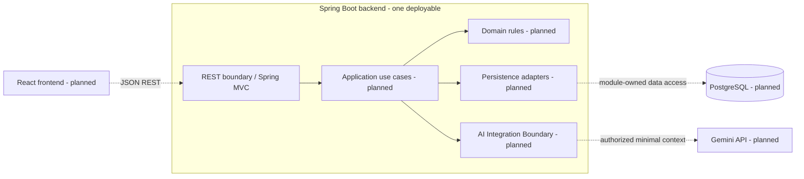

# SmartRent

**AI-integrated rental property management for landlords, property managers, and tenants.**

SmartRent brings rental records, maintenance workflows, and tenant communication into one system. Its approved design combines a modular Spring Boot backend, a React frontend, PostgreSQL, and Gemini assistance behind a backend-controlled AI boundary.

> **Development status:** Sprint 0 documentation and agent configuration are merged. C6-01 backend foundation is implemented and verified locally, with human review pending. This increment is maintained on `codex/c6-01-backend-foundation` and has not yet been merged into `main`; a clean clone of `main` does not yet include it. Business features remain planned. No deployment is documented or configured.

[Roadmap](docs/project-roadmap.md) · [Backend guide](backend/README.md) · [Implementation backlog](docs/chapter-06-ai-programming/implementation-backlog.md) · [API contracts](design/api/README.md)

## Contents

- [Overview](#overview)
- [Implementation status](#implementation-status)
- [Product capabilities](#product-capabilities)
- [Technology stack](#technology-stack)
- [Architecture](#architecture)
- [Repository structure](#repository-structure)
- [Getting started](#getting-started)
- [Environment configuration](#environment-configuration)
- [API overview](#api-overview)
- [Testing](#testing)
- [CI and deployment](#ci-and-deployment)
- [Security principles](#security-principles)
- [Roadmap](#roadmap)
- [Documentation](#documentation)
- [AI-assisted development](#ai-assisted-development)
- [Contributing](#contributing)
- [License and project ownership](#license-and-project-ownership)

## Overview

Rental operations involve linked information: properties and rooms, tenant profiles, contracts, rent records, and maintenance requests. SmartRent is designed to centralize that information and keep access tied to each user's role and relationship to a resource.

Landlords and property managers are the management users; tenants access their own rental information and requests. AI supports classification and information retrieval. It is an integration component, not an actor with independent permission to access data or change business state.

The current runnable increment is the backend foundation. It validates startup, a minimal health endpoint, default-deny HTTP security, and the build/test toolchain. It does not yet provide a usable rental management application.

## Implementation status

The following distinguishes executable behavior from configuration and design intent.

| Area | Status | Evidence / next step |
|---|---|---|
| Requirements, UX, architecture and API designs | Documented; new product-policy details await named review gates | [Sprint 0 decisions](docs/sprint-0-decisions.md) |
| Backend foundation — C6-01 | Implemented locally; IN_REVIEW | [Source](backend/src/main/java/com/smartrent/), [task evidence](docs/ai-evidence/c6-01-backend-foundation.md) |
| Backend build, context and HTTP checks | Verified locally: 11 tests, zero failures/errors/skipped | [Tests](backend/src/test/java/com/smartrent/), [verification instructions](#testing) |
| Backend GitHub Actions | Configured locally and linted; remote execution pending | [Workflow](.github/workflows/backend-ci.yml) |
| Frontend — C6-02 | Planned; no frontend application or package manifest | [Backlog](docs/chapter-06-ai-programming/implementation-backlog.md) |
| Database infrastructure — C6-03 | Planned; no Compose setup, datasource, tables or migrations | [Logical schema](design/database/schema.md) |
| Accounts, JWT and rental business features | Planned; no authentication or business endpoints implemented | [API contracts](design/api/README.md) |
| Gemini classification and Assistant | Planned; no provider calls or integration implemented | [AI boundary](design/architecture/smartrent-architecture.md) |
| Deployment / continuous delivery | Not configured or deployed | Current work targets local development |

C6-01 verification does not complete the full Sprint 1/G1 gate. A working-baseline policy in a design document is not automatically an approved implementation requirement.

## Product capabilities

These are **planned MVP capabilities**, grouped by user outcome. None of the business capabilities below is implemented by C6-01.

| Capability | Intended experience |
|---|---|
| Property and occupancy management | Manage properties, rooms, tenant profiles and rental contracts within an authorized management scope. |
| Rent tracking | Create and view rent records and payment status; no banking integration or AI transaction confirmation. |
| Tenant self-service | View authorized rental information, submit maintenance requests and follow their status. |
| Maintenance operations | Review requests, manage permitted status transitions and notify relevant users. |
| AI-assisted maintenance | Preview category, priority, summary and missing information; retain explicit confirmation and manual fallback under the reviewed contract. |
| Rental information Assistant | Answer questions using only backend-authorized context and acknowledge missing information. |

See [requirements](docs/chapter-03-requirement-analysis/03-requirement-analysis.md), [user stories](docs/chapter-03-requirement-analysis/04-user-stories.md), and [feature specifications](docs/chapter-03-requirement-analysis/05-feature-specification.md). Ownership, lifecycle, billing and AI defaults require the review gates in the [decision register](docs/sprint-0-decisions.md).

## Technology stack

Versions are shown only where they are pinned or resolved in the current backend. Planned components have no selected version yet.

| Layer | Approved technology | Current adoption |
|---|---|---|
| Frontend | React, TypeScript, Vite, Tailwind CSS | Planned |
| Backend | Java 21, Spring Boot **3.5.16**, Spring MVC | Implemented foundation; [Maven configuration](backend/pom.xml) |
| Security | Spring Security **6.5.11**, JWT | Security dependency/default-deny boundary present; JWT planned |
| Persistence | PostgreSQL, Spring Data JPA, Hibernate, Flyway | Planned for database implementation; absent from C6-01 dependencies |
| Application AI | Gemini API through a backend AI Adapter | Planned; model/API version not selected |
| Backend testing | JUnit Jupiter **5.12.2**, Mockito **5.17.0**, Testcontainers | JUnit/Mockito supplied by Boot; Testcontainers planned |
| Frontend/E2E testing | Vitest, Playwright | Planned |
| Build | Maven **3.9.16**, Maven Wrapper **3.3.4** | Pinned wrapper; global Maven not required |
| Infrastructure | Docker Compose, GitHub Actions | Compose planned; backend Actions workflow configured locally |

The pinned Spring Boot parent manages compatible transitive dependencies. See the [backend toolchain guide](backend/README.md#toolchain-and-dependencies) for version selection and upstream sources.

## Architecture

SmartRent uses **Modular Monolith + Layered Architecture + REST API + PostgreSQL + AI Integration Boundary**. The backend is one deployable application with feature modules. Spring MVC handles HTTP requests; it does not turn those modules into separate services.

The diagram shows the approved target architecture. Dashed paths identify integrations that are **planned**, not running in C6-01.



Features are grouped under `identity`, `property`, `room`, `tenant`, `contract`, `payment`, `maintenance`, `notification`, `assistant` and `aiintegration`. Each reserves `api`, `application`, `domain` and `persistence` packages. Most packages currently contain documentation only; bootstrap and foundation HTTP security are executable.

Controllers delegate to application use cases. Domain rules remain independent of HTTP and provider SDKs; persistence adapters stay module-owned. Cross-module work uses public application interfaces or in-process events. Only the backend AI Adapter may call Gemini. Detailed models are in [Chapter 5](docs/chapter-05-software-architecture/01-architecture-design.md) and [architecture artifacts](design/architecture/README.md).

## Repository structure

```text
SmartRent/
├── README.md
├── AGENTS.md                          # shared development-agent rules
├── .agents/skills/                    # repository and upstream skills
├── .gemini/settings.json              # Gemini workspace context
├── .github/workflows/backend-ci.yml   # local backend CI definition
├── backend/
│   ├── pom.xml
│   ├── mvnw, mvnw.cmd
│   ├── .mvn/wrapper/
│   ├── src/main/java/com/smartrent/    # bootstrap and feature/layer packages
│   ├── src/main/resources/            # safe application defaults
│   ├── src/test/java/com/smartrent/    # context, HTTP and config tests
│   └── README.md                      # backend-specific instructions
├── docs/
│   ├── project-roadmap.md
│   ├── sprint-0-decisions.md
│   ├── implementation-readiness.md
│   ├── chapter-03-requirement-analysis/
│   ├── chapter-04-product-design/
│   ├── chapter-05-software-architecture/
│   ├── chapter-06-ai-programming/
│   ├── chapter-07-code-review-refactoring/
│   ├── chapter-08-software-testing/
│   ├── chapter-09-technical-documentation/
│   └── ai-evidence/
├── design/                            # API, architecture, schema, UML and UX
├── prompts/                           # Chapter 3–5 prompt templates
├── demo/                              # Chapter 3–5 design/demo specifications
└── skills-lock.json                   # upstream skill source metadata
```

`backend/target/` contains ignored, regenerable build output. There is no frontend project, Compose configuration or database migration directory yet.

## Getting started

### Prerequisites

- A checkout containing the local C6-01 implementation described above. Until it is published, cloning `main` retrieves the Sprint 0 baseline rather than a runnable backend.
- **JDK 21**, active on `PATH`, with `JAVA_HOME` pointing to the same JDK when set. Java 25 is not the project's build runtime; Maven Enforcer rejects incompatible major versions.
- A POSIX shell for the commands below and `curl` for health checks. The wrapper needs Java and download/extraction tools on first use; see [wrapper requirements](backend/README.md).
- Network access to Maven Central for the initial Maven/dependency downloads. No global Maven, Node.js, Docker, PostgreSQL or Gemini credentials are needed for C6-01.

Use your installed JDK/toolchain manager to activate Java 21 before continuing. JDK paths are machine-specific; temporary paths from development sessions are not project configuration.

### Build and start the backend

Run from the repository root:

```sh
cd backend
java -version
./mvnw --version
./mvnw --batch-mode --no-transfer-progress verify
java -jar target/smartrent-backend-0.0.1-SNAPSHOT.jar
```

The first two commands must report Java 21 and Maven 3.9.16. `verify` runs tests and creates the executable JAR. Startup is complete when the log reports `Started SmartRentApplication` and Tomcat listening on port 8080; the Spring Boot banner alone is not a readiness check.

In another terminal:

```sh
curl --fail --silent --show-error http://127.0.0.1:8080/actuator/health
```

Expected response:

```json
{"status":"UP"}
```

The listener defaults to `127.0.0.1:8080`. Stop the foreground process with **Ctrl+C**. If port 8080 is already in use, select another local port:

```sh
SERVER_PORT=8081 java -jar target/smartrent-backend-0.0.1-SNAPSHOT.jar
```

In another terminal, check the selected port:

```sh
curl --fail --silent --show-error http://127.0.0.1:8081/actuator/health
```

A health response describes this foundation process, not readiness of unimplemented rental features or external dependencies.

### Frontend and database

Frontend setup belongs to C6-02; PostgreSQL, Docker Compose, datasource configuration and Flyway migrations belong to C6-03. Neither setup exists yet, so no frontend install, container startup or database initialization commands are provided. Their planned contracts are in the [implementation backlog](docs/chapter-06-ai-programming/implementation-backlog.md).

## Environment configuration

| Variable | Default | Purpose |
|---|---|---|
| `JAVA_HOME` | Java discovery through `PATH` if unset | Select a JDK 21 installation for the wrapper; keep `PATH` consistent for `java -jar`. |
| `SERVER_ADDRESS` | `127.0.0.1` | Local listener address. |
| `SERVER_PORT` | `8080` | HTTP port; malformed values fail startup binding. |

[Application settings](backend/src/main/resources/application.yml) contain no database, JWT or provider credentials. C6-01 requires none of those secrets, and no `.env.example` or automatic `.env` loader is supplied. Set supported values through the shell environment; keep secrets out of source, prompts, logs and evidence. Future tasks must document and validate their own required configuration.

## API overview

**Available now:** GET `/actuator/health`, returning status only. All other HTTP paths are denied by the foundation security boundary, including unimplemented `/api` routes. That temporary HTTP 403 behavior does not implement the future JWT authentication/error contract.

**Designed, not implemented:** JSON REST resources under `/api`, using UUIDs, `snake_case` fields, UTC timestamps, bounded pagination and a common error envelope. Protected use cases must enforce role and ownership in the backend.

| Contract | Planned resources |
|---|---|
| [Authentication and identity](design/api/authentication-api.md) | Login, current user, Tenant Profile and authorized read-only Assistant |
| [Property](design/api/property-api.md) / [Room](design/api/room-api.md) | Rental property and room management |
| [Contract](design/api/contract-api.md) / [Payment](design/api/payment-api.md) | Rental agreements and rent tracking |
| [Maintenance](design/api/maintenance-api.md) | Request lifecycle, AI preview/confirmation and reclassification |
| [Notification](design/api/notification-api.md) | Recipient-scoped in-app notifications |

See [API conventions](docs/chapter-05-software-architecture/05-api-design.md) and the [contract index](design/api/README.md). No generated OpenAPI/Swagger interface or running business API is currently supplied.

## Testing

From `backend/`, with JDK 21 active:

```sh
./mvnw --batch-mode --no-transfer-progress verify
```

The maintained suite currently contains **11 tests** across `SmartRentApplicationTests` and `ServerConfigurationTests`. It exercises a real embedded HTTP server, minimal health output, denial of non-health requests, absence of default accounts/datasource, write/logout rejection and invalid port binding. Reports are generated in `backend/target/surefire-reports/`.

To resolve dependencies/plugins ahead of a build:

```sh
./mvnw --batch-mode --no-transfer-progress dependency:go-offline
```

Database/Testcontainers, frontend/Vitest, Playwright E2E and Gemini evaluation suites are planned, not passing test suites in this increment. See the [testing strategy](docs/chapter-08-software-testing/test-strategy.md) for their future gates.

## CI and deployment

The local [Backend CI workflow](.github/workflows/backend-ci.yml) selects Temurin Java 21 and runs the same wrapper `verify` command on backend/workflow push or pull-request changes, or manual dispatch. It uses SHA-pinned official actions, read-only repository contents permission, no persisted checkout credentials, concurrency cancellation and a 15-minute timeout.

The workflow has been linted locally. It has not been pushed or executed on GitHub for C6-01; no remote CI success is claimed. There is no deployment job, live environment or continuous-delivery pipeline. Current development and verification are local.

## Security principles

**Implemented foundation controls:** loopback binding, status-only health exposure, default-deny HTTP access, no generated login account/basic/form login/logout, no sessions, retained CSRF protection and no public error/configuration dumps.

**Required for future features:** server-side role and ownership checks on collections, filters, reads and writes; DTO allowlists; immutable server-owned identity fields; reviewed JWT/CORS settings; Flyway-controlled schema evolution; and cross-tenant/cross-landlord denial tests.

AI context must be authorized and minimized before leaving the backend. Provider output is untrusted and must be validated. AI cannot authorize users, query PostgreSQL directly, confirm financial transactions or perform critical state transitions. Preview/confirmation, manual fallback and notification behavior must follow the applicable reviewed decision gates.

See [AGENTS.md](AGENTS.md), the [security boundary design](docs/chapter-05-software-architecture/01-architecture-design.md) and [decision register](docs/sprint-0-decisions.md). These principles are implementation obligations, not evidence that all security features already exist.

## Roadmap

| Milestone | Scope | Current state |
|---|---|---|
| Sprint 0 | Normalize requirements/design contracts; establish agent rules and delivery gates | Baseline merged; named product-policy gates remain applicable |
| Sprint 1 — C6-01–05 | Backend/frontend foundation, CI, database, provisioning and authentication | C6-01 locally IN_REVIEW; C6-02–05 TODO |
| Sprint 2 — C6-06–07 | Property/Room and Tenant Profile | Planned; ownership/model/lifecycle review required |
| Sprint 3 — C6-08–09 | Contract and Payment | Planned; overlap and billing gates required |
| Sprint 4 — C6-10–13 | Maintenance, notifications and Gemini preview/confirmation | Planned; UX, AI and delivery-policy gates required |
| Sprint 5 — C6-14–16 | Assistant, regression/refactoring, documentation and demo readiness | Planned |

Follow the [dependency-ordered roadmap](docs/project-roadmap.md) and [task acceptance criteria](docs/chapter-06-ai-programming/implementation-backlog.md). Review, testing and documentation happen within every sprint. Sprint numbers express dependencies, not release dates or permission to start additional work.

## Documentation

| Topic | Entry point |
|---|---|
| Product discovery and requirements | [Chapter 3](docs/chapter-03-requirement-analysis/01-product-discovery.md), [PRD](docs/chapter-03-requirement-analysis/02-PRD.md) |
| UX and maintenance journey | [Chapter 4](docs/chapter-04-product-design/01-user-flow.md), [wireframes](design/wireframes/maintenance-request-wireframe.md) |
| Architecture and patterns | [Chapter 5](docs/chapter-05-software-architecture/01-architecture-design.md), [pattern decisions](design/architecture/architecture-pattern-decisions.md) |
| API, UML and schema artifacts | [API index](design/api/README.md), [UML index](design/uml/README.md), [database index](design/database/README.md) |
| Decisions and implementation tasks | [Decision gates](docs/sprint-0-decisions.md), [Chapter 6 backlog](docs/chapter-06-ai-programming/implementation-backlog.md) |
| Backend operation | [Backend guide](backend/README.md) |
| Code review and refactoring | [Chapter 7 plan](docs/chapter-07-code-review-refactoring/review-plan.md) |
| Verification strategy | [Chapter 8 plan](docs/chapter-08-software-testing/test-strategy.md) |
| Technical documentation | [Chapter 9 plan](docs/chapter-09-technical-documentation/documentation-plan.md) |
| Agent instructions and handoff | [Root rules](AGENTS.md), [agent workflow](docs/agent-workflow.md) |
| AI provenance | [Evidence index](docs/ai-evidence/README.md), [C6-01 record](docs/ai-evidence/c6-01-backend-foundation.md), [prompt templates](prompts/) |
| Design/demo specifications | [Chapter 3](demo/chapter-03/README.md), [Chapter 4](demo/chapter-04/README.md), [Chapter 5](demo/chapter-05/README.md) |
| Historical Sprint 0 audit | [Readiness report](docs/implementation-readiness.md) — a dated baseline report, not current backend runtime status |

Some course/design documents are written in Vietnamese. Design artifacts and demo specifications describe intent; they are not proof of executed features or model runs.

## AI-assisted development

SmartRent follows the CS2028 AI Product Development process. Development tools support specification, planning, implementation and review while humans retain product-policy and merge decisions.

Use **Specify → Plan → Implement → Test → Review → Merge**, with real **Context → Prompt → AI Output → Human Review → Refinement → Final Result** evidence. Record actual commands/results and distinguish self-review, human review and unexecuted checks. Prompt templates alone are not historical usage evidence.

Repository-local Codex/Gemini rules and task-specific skills are described in the [agent workflow](docs/agent-workflow.md). Development-agent tooling does not add an application AI provider: the approved application integration remains Gemini behind the backend Adapter. Follow the [evidence policy](docs/ai-evidence/README.md) and preserve unresolved business gates during handoff.

## Contributing

1. Read [AGENTS.md](AGENTS.md), the relevant task/AC and its requirement, UX, API and schema sources.
2. Confirm scope and pending decisions; preserve existing local changes. Use a focused task branch, normally `codex/<task-slug>`.
3. Implement one reviewable change within the approved stack and module boundaries. Do not expand requirements or start another task implicitly.
4. Run the applicable checks and report passed, failed and not-run results. Update relevant documentation/evidence within the authorized scope.
5. Review the actual diff for correctness, isolation, secrets, migrations and AI safety; resolve findings before requesting review.
6. Use English Conventional Commits: `type(scope): imperative description`, for example `docs(readme): clarify local setup and implementation status`. Commit, push, merge and deployment require their own authorization in the agent workflow.

Pull requests should explain the problem/outcome, scope, validation, review notes and limitations. No dedicated CONTRIBUTING, CODE_OF_CONDUCT or SECURITY policy file is currently provided; use the existing workflow rather than assuming those policies exist.

## License and project ownership

Repository: [aanhtuan/SmartRent](https://github.com/aanhtuan/SmartRent). No project-wide LICENSE file or formal maintainer roster is currently declared in the repository. Licenses bundled with upstream skills do not establish the license for SmartRent itself.
