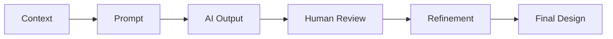

# Bài thực hành 5 – AI-Assisted Software Architecture Design

## Mục tiêu

Bài thực hành chứng minh quy trình dùng AI có kiểm soát để tạo thiết kế kiến trúc SmartRent. AI hỗ trợ phân tích, đề xuất và kiểm tra tính nhất quán; Human Reviewer vẫn là người phê duyệt architecture decision, security boundary, data model và API contract. Đây là evidence thiết kế, không phải application code.

## Quy trình chung

| Bước | Cách thực hiện trong Chapter 5 |
|---|---|
| Context | Cung cấp requirement/product design trước đó và scope MVP. |
| Prompt | Nêu rõ deliverable, constraints, traceability và câu hỏi cần AI hỗ trợ. |
| AI Output | Sinh đề xuất/diagram/specification ở dạng có thể review. |
| Human Review | Đối chiếu FR, user flow, security, AI guardrail và không tự chấp nhận output. |
| Refinement | Sửa các assumption, boundary, naming, fallback hoặc trade-off chưa đúng. |
| Final Design | Lưu Markdown/Mermaid artifact đã được human review vào `docs/` và `design/`. |

## Prompt reference policy

`prompts/chapter-05/` chưa tồn tại tại thời điểm hoàn thành bài thực hành. Vì không tự tạo prompt artifact ngoài yêu cầu, mỗi demo bên dưới sử dụng **prompt template inline** làm prompt reference. Khi thư mục prompt được bổ sung sau này, lưu bản prompt đã dùng ở đó và thay reference inline bằng link file/phiên bản cụ thể.

## Guardrails áp dụng cho mọi demo

- Giữ SmartRent là **Modular Monolith + Layered Architecture + REST API + PostgreSQL + AI Integration Boundary**; không tự chuyển sang microservices.
- Backend, không phải frontend hay AI, kiểm soát authentication, authorization và business workflow.
- AI không truy cập database trực tiếp, không tự quyết định authorization, không thay đổi critical business state và không hoàn tất Maintenance Request.
- AI output phải được validate trước business logic/persistence; khi AI unavailable, request vẫn được xử lý thủ công với `PENDING`.
- Không thêm actor, entity, API hoặc design pattern nếu requirements không chứng minh là cần thiết.

## Demo 1 – Architecture Design

**Objective:** Chuyển requirements và Maintenance flow thành kiến trúc tổng thể có component boundary, data flow, security boundary và fallback AI.

**Input/context:** Chapter 3 FR-01 đến FR-10, Feature F-01/F-03; Chapter 4 user flow/prototype/review; đặc biệt `PENDING → PROCESSING → COMPLETED`, authorization backend và AI fallback.

**Prompt reference:** Inline template: “Thiết kế kiến trúc MVP SmartRent theo Modular Monolith, Layered Architecture, REST API và PostgreSQL. Mô tả Frontend → REST API → Backend Modules → PostgreSQL và Backend → AI Integration → External Provider → Validate Output → Business Logic. Không cho AI DB/auth/state authority; thiết kế fallback.”

**Expected AI output:** Architecture overview, module responsibility, layers, PostgreSQL boundary, AI gateway/adapter, notification-after-commit, maintenance flow, security/NFR/trade-off/scalability diagrams.

**Human Review:** Kiểm tra AI không được biểu diễn như authenticated actor; owner/tenant checks nằm ở backend; `PENDING` được tạo khi AI failure; notification không rollback business state; không có microservice assumption.

**Final result:** [5.1 Architecture Design](../../docs/chapter-05-software-architecture/01-architecture-design.md) và [architecture artifact](../../design/architecture/smartrent-architecture.md).

**Evidence cần lưu:** prompt version/input list, proposed diagram, review comments/quyết định, final Markdown artifact và link requirement traceability.

## Demo 2 – Architecture Pattern Analysis

**Objective:** So sánh Layered Architecture, Modular Monolith và Microservices theo driver/thực tế MVP để chọn cấu trúc phù hợp, không chọn theo xu hướng.

**Input/context:** Architecture 5.1, domain room–tenant–contract–payment–maintenance liên quan chặt, một PostgreSQL authoritative store, team/MVP scope và AI dependency có fallback.

**Prompt reference:** Inline template: “So sánh Layered Architecture, Modular Monolith và Microservices cho SmartRent theo complexity, maintainability, scalability, deployment và consistency. Nêu trade-off, khi dùng/không dùng; không chuyển hệ thống thành microservices nếu không có evidence.”

**Expected AI output:** Definition/structure/use case cho từng pattern, bảng comparison, trade-off và re-evaluation trigger dựa trên tải, ownership, SLA hoặc platform maturity.

**Human Review:** Xác minh Layered và Modular giải quyết hai vấn đề khác nhau nên có thể kết hợp; không tuyên bố pattern nào tốt nhất tuyệt đối; microservices chỉ là future option có điều kiện rõ ràng.

**Final result:** [5.2 Architecture Patterns](../../docs/chapter-05-software-architecture/02-architecture-patterns.md) và [pattern decision artifact](../../design/architecture/architecture-pattern-decisions.md).

**Evidence cần lưu:** criteria/assumption được đưa vào prompt, comparison draft, trade-off feedback, decision matrix và trigger review sau này.

## Demo 3 – UML Modeling

**Objective:** Mô hình hóa actor, component, class/entity, Maintenance sequence và data relationship để mọi boundary được nhìn thấy/kiểm tra được.

**Input/context:** Chapter 3 actors/FR, Chapter 4 Maintenance main/missing-information/failure flows, Architecture 5.1 và database/AI constraints.

**Prompt reference:** Inline template: “Tạo Mermaid UML specifications cho SmartRent: use case, component, class, Maintenance sequence và ER overview. Maintenance phải đi Tenant → Frontend → API → Authorization → Service → AI Adapter → Provider → Validate → PostgreSQL → Notification; AI không có DB/auth/completion path.”

**Expected AI output:** Use case với Tenant, Manager/Landlord, System, AI Provider; component boundary; logical class/cardinality; main/alternative sequences; ER relationship specification.

**Human Review:** Kiểm tra không thêm Admin actor riêng khi chưa có use case; Manager/Landlord scope đúng property; sequence không có arrow AI Provider → DB/Authorization/Complete; original description và fallback hiển thị rõ.

**Final result:** [5.3 System Modeling & UML](../../docs/chapter-05-software-architecture/03-system-modeling-uml.md) và [UML artifact index](../../design/uml/README.md).

**Evidence cần lưu:** prompt, Mermaid source/draft, diagram-render/review result, actor/entity decision log và traceability table.

## Demo 4 – Database Design

**Objective:** Thiết kế logical PostgreSQL schema tối thiểu nhưng đủ cho identity, rental data, Maintenance workflow, notification và validated AI metadata.

**Input/context:** Required entities User, Tenant Profile, Property, Room, Contract, Payment, Maintenance Request, Notification; UML cardinality; API/resource needs; Postgres/Repository boundary.

**Prompt reference:** Inline template: “Thiết kế schema PostgreSQL logical cho các entity bắt buộc. Nêu table/column/type/PK/FK/null/unique/default/enum/index, normalization, integrity, ownership, auditability và extensibility. Maintenance cần original description, category, priority, summary, confidence, status và timestamps. Không tạo migration/SQL; AI không bypass validation.”

**Expected AI output:** Table dictionary, controlled value sets, FK/cardinality ERD, indexes theo list/authorization queries, nullable AI metadata và constraints cho integrity/fallback.

**Human Review:** Đối chiếu entity với requirements để không thêm chat/raw-provider/attachment table chưa cần; kiểm tra `PENDING` default, active contract check ở backend, category/priority/confidence validation và AI Provider không có credential/ER entity.

**Final result:** [5.4 Database Design](../../docs/chapter-05-software-architecture/04-database-design.md), [schema](../../design/database/schema.md) và [ERD](../../design/database/erd.md).

**Evidence cần lưu:** schema draft, entity inclusion/exclusion rationale, constraint/index review, Mermaid ERD, data-security review và final schema specification.

## Demo 5 – API Design

**Objective:** Thiết kế REST contract có authentication, authorization, validation, error handling và resource scope nhất quán với schema/architecture.

**Input/context:** Database schema 5.4, module ownership 5.1, requirements CRUD/workflow, standard error envelope, Maintenance user flow và AI constraints.

**Prompt reference:** Inline template: “Thiết kế REST API `/api` cho Authentication, Users/current user, Tenant Profiles, Properties, Rooms, Contracts, Payments, Maintenance Requests, Notifications và AI Assistant theo FR-09. Với mỗi endpoint nêu method, URL, purpose, auth/authz, request/response, validation/error/status. Thiết kế GET/POST/GET-by-ID/PATCH-status/classify cho maintenance; classify không bypass backend authorization.”

**Expected AI output:** Resource map, endpoint tables, standard error response/status matrix, pagination/identifier convention, AI Assistant dùng backend-filtered context, authorized Maintenance classification endpoint và AI failure semantics.

**Human Review:** Xác minh Tenant chỉ tạo/xem request hợp lệ; Manager/Landlord chỉ manage owned properties; POST request vẫn `201 PENDING` khi initial AI failure; classify chỉ cập nhật validated metadata, không status; `PATCH status` không cho AI/Tenant thực hiện.

**Final result:** [5.5 API Design](../../docs/chapter-05-software-architecture/05-api-design.md) và [API artifact index](../../design/api/README.md).

**Evidence cần lưu:** endpoint draft, payload/error examples, authorization matrix review, API-to-schema mapping, abuse/AI-boundary review và final endpoint documentation.

## Demo 6 – Design Pattern Selection

**Objective:** Chọn pattern cục bộ thực sự giải quyết coupling/variation của Modular Monolith thay vì tạo abstraction không cần thiết.

**Input/context:** Layered Architecture, PostgreSQL repository boundary, Maintenance Service orchestration, AI provider volatility, notification delivery channel scope và API use cases.

**Prompt reference:** Inline template: “Đánh giá Repository, Service Layer, Adapter, Strategy và Factory cho SmartRent. Với mỗi pattern nêu problem, intent, structure, concrete use case/component, benefits, trade-off và có thực sự cần không. Strategy chỉ cho AI/rule fallback nếu có policy; Factory chỉ cho notification channels nếu có nhiều channel.”

**Expected AI output:** Decision matrix phân biệt Adopt/Conditional/Defer, component diagram, triggers để thêm Strategy/Factory và guardrail không làm AI bypass workflow.

**Human Review:** Chấp nhận Repository/Service Layer/Adapter vì boundary đã tồn tại; từ chối Strategy khi chỉ có AI + manual `PENDING` fallback; từ chối Factory khi chỉ có in-app channel; không dùng generic repository hoặc “god service”.

**Final result:** [5.6 Design Patterns](../../docs/chapter-05-software-architecture/06-design-patterns.md) và [pattern decisions](../../design/patterns/pattern-decisions.md).

**Evidence cần lưu:** pattern problem statement, alternative decision matrix, decision/decline rationale, component placement, conditional trigger và final review approval.

## Completion check – Chapter 5

| Requirement | Status | Evidence |
|---|---|---|
| 5.1 Architecture Design | Complete | [01-architecture-design.md](../../docs/chapter-05-software-architecture/01-architecture-design.md) |
| 5.2 Architecture Patterns | Complete | [02-architecture-patterns.md](../../docs/chapter-05-software-architecture/02-architecture-patterns.md) |
| 5.3 System Modeling & UML | Complete | [03-system-modeling-uml.md](../../docs/chapter-05-software-architecture/03-system-modeling-uml.md) |
| 5.4 Database Design | Complete | [04-database-design.md](../../docs/chapter-05-software-architecture/04-database-design.md) |
| 5.5 API Design | Complete | [05-api-design.md](../../docs/chapter-05-software-architecture/05-api-design.md) |
| 5.6 Design Patterns | Complete | [06-design-patterns.md](../../docs/chapter-05-software-architecture/06-design-patterns.md) |
| Bài thực hành 5 | Complete | This README and six demos above. |

**Kết quả kiểm tra:** Chapter 5 có đủ 6 phần và Bài thực hành 5. Không có application code hoặc Git commit được tạo trong bài thực hành này.
