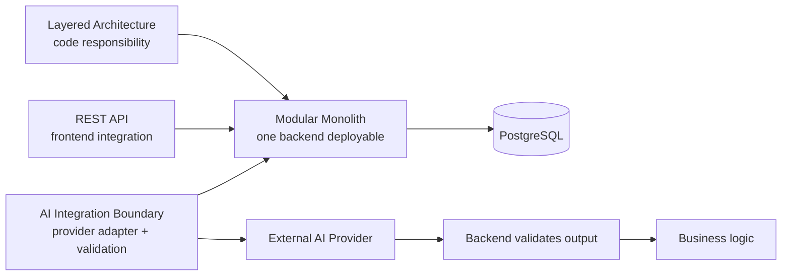

# SmartRent – Architecture Pattern Decisions

## Decision summary



| Pattern | Decision | Reason / trade-off |
|---|---|---|
| Layered Architecture | Adopt | Keeps controller, use case, domain policy and data access separate; needs discipline to avoid empty/pass-through layers. |
| Modular Monolith | Adopt | Keeps current related rental workflows and PostgreSQL transactions simple; modules must preserve interface/schema ownership. |
| REST API | Adopt | Clear frontend contract; backend still owns validation and authorization. |
| AI Integration Boundary | Adopt | Isolates provider and validates untrusted output; adds adapter/monitoring work but preserves security and fallback. |
| In-process domain event after commit | Adopt | Decouples notification delivery from state changes; durable queue/outbox can be added if required. |
| Microservices | Defer | Independent scaling/deployments do not currently outweigh distributed-data, network and operational complexity. |

## Guardrails

```text
Frontend → REST API → Backend Modules → PostgreSQL

Backend → AI Integration → External AI Provider
        → Validate AI output → Business Logic
```

- AI has no direct database access.
- AI never decides authorization.
- AI cannot change critical business state or complete Maintenance Requests.
- AI unavailable/invalid result: save the request as `PENDING` for manual handling.

## Re-evaluation evidence

Consider extracting a module only after measured independent load/SLA, stable bounded-context ownership, repeated independent-release needs and platform readiness for service security, tracing, deployment and distributed consistency. The first likely candidates are AI Integration or notification delivery, not the entire SmartRent domain.
