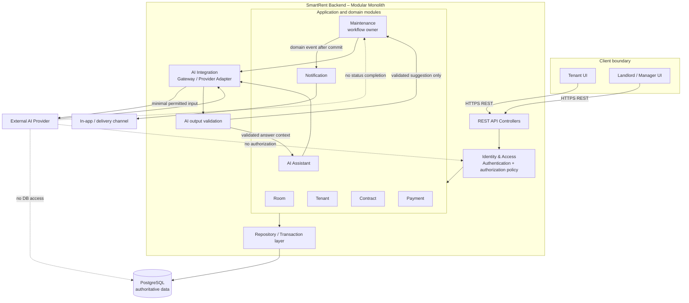
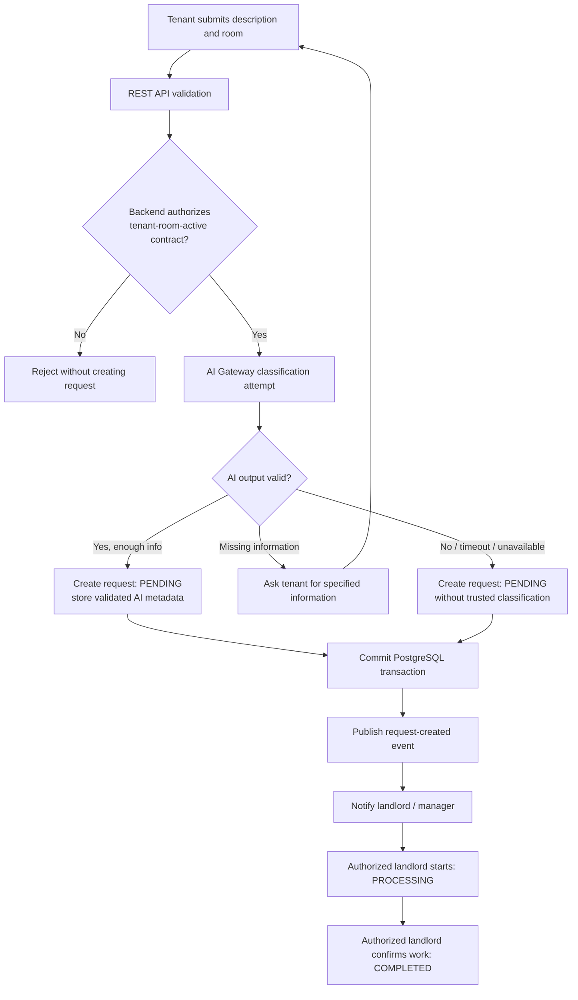
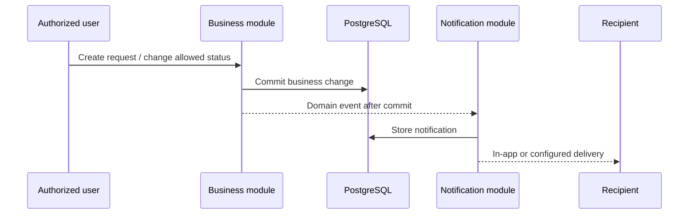

# SmartRent – Architecture Design Artifact

## Scope and constraints

- Architecture: **Modular Monolith**, **Layered Architecture**, **REST API**, **PostgreSQL**.
- AI đi qua **AI Integration Module / Gateway / Adapter**.
- Không thiết kế microservices cho MVP.
- AI không có direct database access, authorization authority, quyền thay đổi critical business state hay quyền tự hoàn tất Maintenance Request.

## Component and security boundaries



## Layer rule

```text
Frontend → REST Controller → Application Use Case → Domain Rules/Policy
         → Repository/Transaction → PostgreSQL

Only the backend calls AI:
Business module → AI Gateway/Adapter → External AI Provider
               ← validated structured output ←
```

The controller does not query PostgreSQL directly. The AI provider does not join the application trust zone: it receives no database credentials or internal authorization capability, and its output is untrusted until validated by the backend.

## Maintenance request flow



`PENDING`, `PROCESSING`, `COMPLETED` and optional `CANCELLED` are controlled by Maintenance domain rules. AI category, priority, summary and confidence are recommendations only. In particular, no AI response can transition an item to `COMPLETED`.

## AI classification contract and fallback

```text
Permitted backend input
  = request text + only necessary authorized context

Expected AI suggestion
  = category + priority + summary + missing_information + confidence

Backend validation
  = schema + allowed enums + field types/limits + confidence range + business rules

Failure (provider/network/timeout/invalid response)
  = save original request as PENDING → notify manual handling
```

The UI must clearly communicate the fallback specified in Chapter 4: request received, classification temporarily unavailable, manual processing continues. Original description is retained and shown in request detail.

## Notification event flow



The notification is a reaction to an already-committed event. Delivery failure is retried/observed independently and does not reverse a completed business transaction.

## Requirement linkage

| Source | Architecture representation |
|---|---|
| Chapter 3 FR-01, role requirements | Identity & Access boundary and server-side ownership checks. |
| Chapter 3 FR-02–FR-05 | Room, Tenant, Contract, Payment modules over PostgreSQL. |
| Chapter 3 FR-06–FR-08 | Maintenance workflow and after-commit Notification Module. |
| Chapter 3 F-01/F-02 | Structured AI Adapter, validation and backend-scoped AI Assistant context. |
| Chapter 4 user flow/review | `PENDING` fallback, original description, missing-information loop and backend-owned status transition. |
