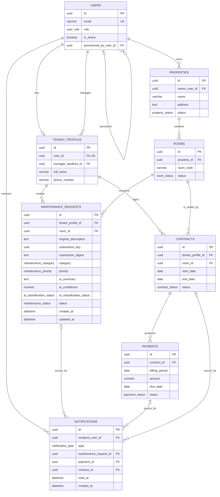

# SmartRent – Entity Relationship Diagram

> Sprint 0 revision: see the [decision baseline](../../docs/sprint-0-decisions.md). New ownership/lifecycle/billing/preview policies are working baseline until the named review gate passes; this document is a design artifact, not implemented behavior. Canonical FR IDs follow Requirement Analysis.

## Logical ERD

## Cardinality and integrity notes

| Relationship | Cardinality | Constraint / policy |
|---|---|---|
| User – Tenant Profile | `1 : 0..1` | `tenant_profiles.user_id` is UNIQUE and mandatory. Backend ensures role is `TENANT`. |
| User – Property | `1 : 0..*` | `properties.owner_user_id` is mandatory. Backend verifies manager/landlord ownership for managed resources. |
| Property – Room | `1 : 0..*` | Every room has one property; room code is unique within property. |
| Tenant Profile – Contract – Room | `1 : 0..*` on each side | Each contract names one tenant and one room. Active period/status is verified by backend for request authorization. |
| Contract – Payment | `1 : 0..*` | One payment per contract and billing period. |
| Tenant Profile / Room – Maintenance Request | `1 : 0..*` | Every request has one creator tenant and one room; active contract check happens before insert. |
| User – Notification | `1 : 0..*` | One recipient per notification. |
| Event source – Notification | `1 : 0..*` logically | Exactly one of three source FK columns is non-null, enforced by check constraint. |

## AI and workflow boundary

`category`, `priority`, `ai_summary`, `ai_confidence`, `ai_missing_information` (documented in the schema) and `ai_classification_status` belong to `MAINTENANCE_REQUESTS` because they describe the current request. They are optional and only persisted by the backend after AI-result validation. The external AI Provider has no ERD entity, FK, credential or direct link to PostgreSQL.

`MAINTENANCE_REQUESTS.status` defaults to `PENDING` and is controlled by Maintenance business rules. AI metadata never grants authorization and cannot transition a request to `COMPLETED`.
