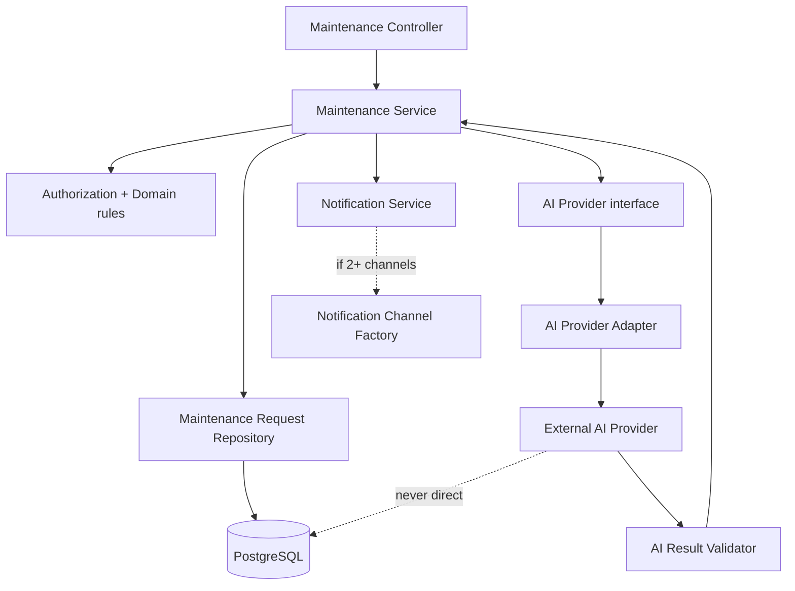

# SmartRent – Design Pattern Decisions

## Decision matrix

| Pattern | Status | Component placement | Why / threshold |
|---|---|---|---|
| Repository | Adopt | `*Service → *Repository → PostgreSQL` | Real data-access boundary and module-owned queries. Avoid generic repository. |
| Service Layer | Adopt | `Controller → *Service → Policy/Repository/Adapter` | Real cross-cutting use-case orchestration: authorization, transaction, AI validation, event. |
| Adapter | Adopt | `AIService → AIProvider interface → Provider Adapter` | Real external-provider volatility and security boundary. |
| Strategy | Defer / conditional | `ClassificationStrategy` | Add only when AI and approved deterministic rule-based classifications are both real policies. |
| Factory | Defer / conditional | `NotificationChannelFactory` | Add only when more than one configured delivery channel exists. |

## Component placement

## Guardrails

- Repository performs data access; it does not implement authorization or business status transition.
- Service validates authorization, lifecycle and AI result before calling repository.
- Adapter converts provider-specific interaction into an internal suggestion contract; provider output is untrusted.
- Strategy output, if introduced, is still only a classification suggestion; manual `PENDING` fallback remains available.
- Factory only creates delivery handlers; it cannot choose business outcomes or bypass post-commit notification flow.

## Conditional-pattern triggers

| Pattern | Introduce when | Do not introduce when |
|---|---|---|
| Strategy | There are at least two approved classification policies with tests, selection rule and consistent validation contract. | The only behavior is AI + manual fallback. |
| Factory | At least two enabled notification channel types need configuration-specific creation. | Only in-app notification delivery exists. |

No pattern here changes the architecture decision: SmartRent remains a Modular Monolith with Layered Architecture, REST API, PostgreSQL and AI Integration Boundary.
