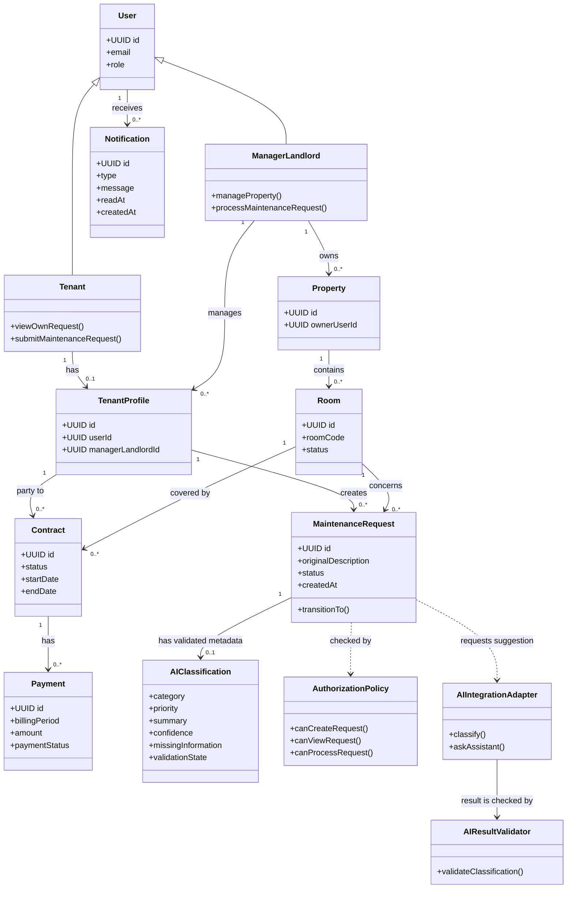

# SmartRent – Class Diagram Specification

> Sprint 0 revision: see the [decision baseline](../../docs/sprint-0-decisions.md). New ownership/lifecycle/billing/preview policies are working baseline until the named review gate passes; this document is a design artifact, not implemented behavior. Canonical FR IDs follow Requirement Analysis.

## Logical domain model

This diagram shows conceptual classes/entities and their important relationships. Attributes are a design-level view; it does not prescribe source-code classes, ORM mappings or every database column.

## Invariants and ownership

| Concept | Owner / invariant |
|---|---|
| `MaintenanceRequest.status` | Maintenance domain owns transition. New request is `PENDING`; AI cannot transition to `COMPLETED`. |
| `originalDescription` | Preserved regardless of AI success/failure and displayed in request detail. |
| `AIClassification` | Optional metadata attached only after validation; no valid result is required to create a `PENDING` request. |
| `Contract` relation | Authorization for request creation checks that the tenant–room relation is active. |
| `AuthorizationPolicy` | Evaluates role plus resource relationship server-side; it is not an AI input/output responsibility. |
| `Notification` | Created from a committed domain event and addressed to an authorized recipient. |

`role`, `status`, category and priority are controlled value sets defined by Chapter 3, not arbitrary user/AI text. Optional image attachment is an acceptance criterion only “if supported”; it is intentionally not modeled as a required entity in this MVP overview.

AIClassification is a conceptual value object embedded in MaintenanceRequest persistence, not an independent table/entity. Roles shown through conceptual inheritance do not require JPA entity inheritance. Working-baseline ownership and lifecycle rules require their named review gates.
