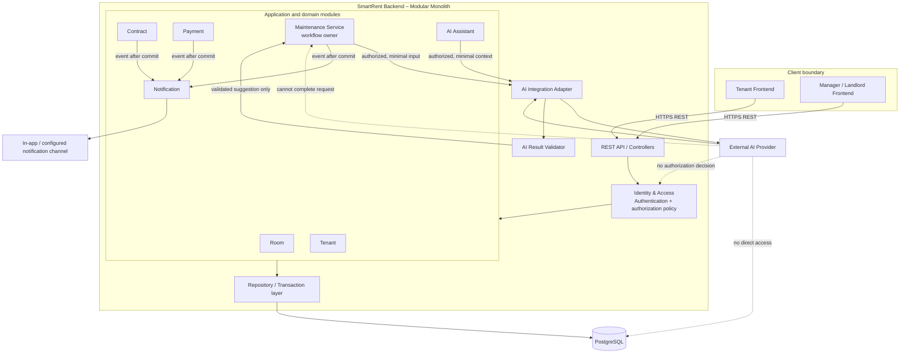

# SmartRent – Component Diagram Specification

## Component view

## Responsibilities and dependencies

| Component | Responsibility | Allowed dependency / boundary |
|---|---|---|
| Frontend | UI, form UX, request/response presentation. | Reaches only REST API; does not enforce authoritative authorization. |
| REST API | Input shape validation and mapping to use case. | Delegates identity/policy and module use case; no direct database access. |
| Identity & Access | Authentication, role/ownership policy. | Supplies caller context to use case; is never delegated to AI. |
| Maintenance Service | Request lifecycle, domain rules and persistence coordination. | Calls AI Adapter only after authorization; owns status transition. |
| AI Integration Adapter + Validator | Provider isolation, timeout/failure handling, parse/schema/rule validation. | May return suggestion or failure; cannot write domain state directly. |
| Repository / Transaction | Controlled data access and transaction boundary. | Only backend component connects to PostgreSQL. |
| Notification | Persists/delivers post-commit notification. | Reacts to domain event; cannot roll back or transition maintenance state. |

## Architectural constraints

`Frontend → REST API → Backend Modules → PostgreSQL` is the authoritative data path. The AI path is `Backend → AI Integration → AI Provider → Validate AI Result → Business Logic`. This component model preserves the 5.1 Modular Monolith and Layered Architecture decision; its modules are not independently deployed microservices.
