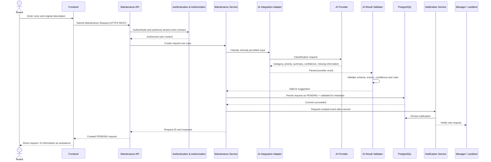
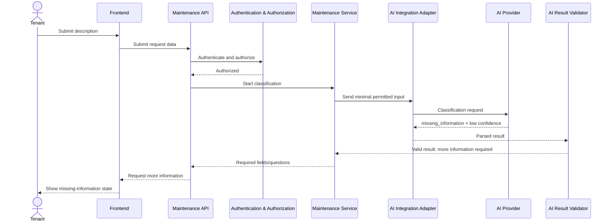

# SmartRent – Maintenance Request Sequence Diagram

## Main flow: valid AI classification



## Alternative: missing information



This branch does not allow an AI provider to infer unavailable facts. After Tenant supplies information, the authorized classification flow repeats.

## Alternative: AI unavailable or invalid output

```mermaid
sequenceDiagram
  actor T as Tenant
  participant F as Frontend
  participant API as Maintenance API
  participant Auth as Authentication & Authorization
  participant M as Maintenance Service
  participant A as AI Integration Adapter
  participant P as AI Provider
  participant V as AI Result Validator
  participant DB as PostgreSQL
  participant N as Notification Service
  participant L as Manager / Landlord

  T->>F: Submit description
  F->>API: Submit request data
  API->>Auth: Authenticate and authorize
  Auth-->>API: Authorized
  API->>M: Create request use case
  M->>A: Attempt classification
  A->>P: Provider request
  alt timeout/provider unavailable
    P--x A: No response / error
    A-->>M: Classification unavailable
  else output invalid
    P-->>A: Invalid/unparseable result
    A-->>V: Parsed attempt
    V-->>M: Rejected result
  end
  M->>DB: Persist original description as PENDING, no trusted classification
  DB-->>M: Commit succeeded
  M->>N: Request-created event after commit
  N-->>L: Notify manual handling queue
  M-->>API: Created request with fallback state
  API-->>F: AI unavailable; request received
  F-->>T: Show PENDING / manual handling
```

The sequence deliberately has no `AI Provider → PostgreSQL`, `AI Provider → Authorization`, or `AI Provider → complete request` message. Status processing/complete is a later, separately authorized Manager/Landlord action through the Maintenance Service.
