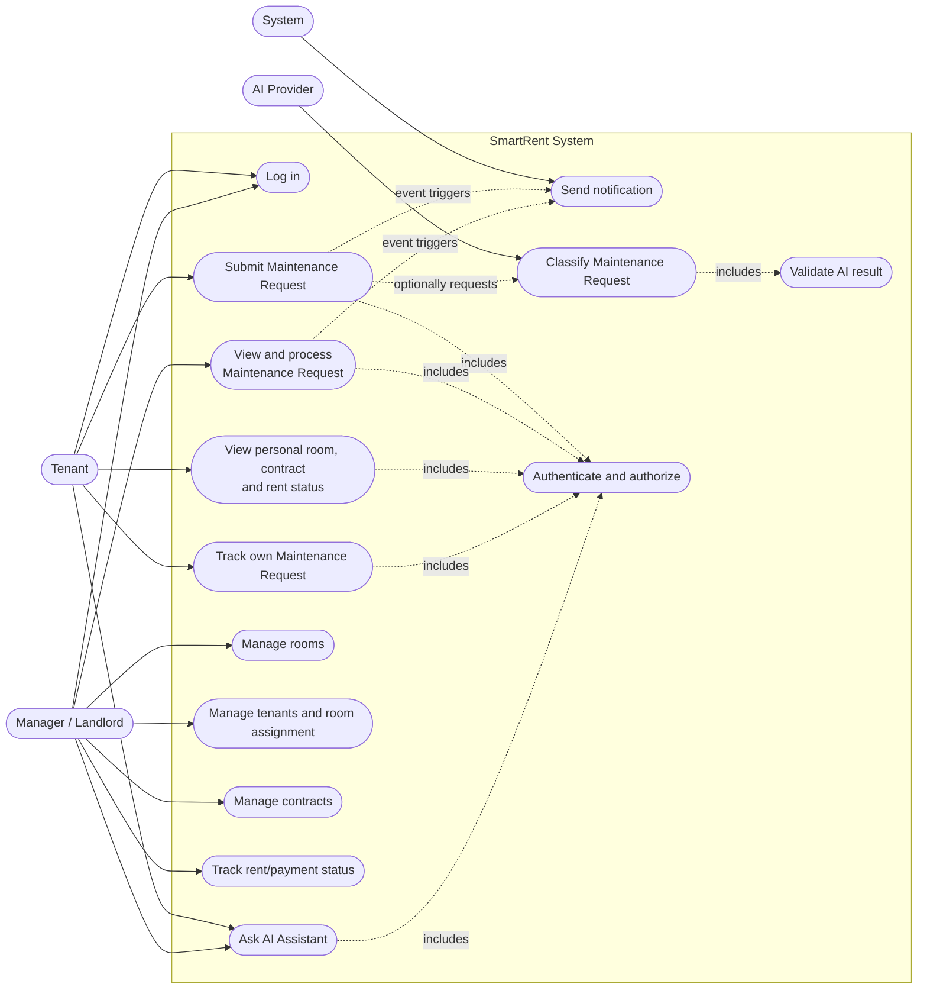

# SmartRent – Use Case Diagram Specification

## Scope

Use case dưới đây bao phủ các chức năng MVP đã nêu ở Chapter 3. **Manager/Landlord** đại diện cho role quản lý trong PRD (`Admin/Landlord`); không tạo Admin actor tách riêng vì chưa có requirement/use case độc lập cho actor đó. **System** tự động gửi notification sau event; **AI Provider** chỉ cung cấp phân tích ngoài hệ thống.

## Use case rules

| Use case | Actor | Preconditions / outcome |
|---|---|---|
| Log in | Tenant, Manager/Landlord | Valid credentials establish an authenticated session/context according to FR-01. |
| Submit Maintenance Request | Tenant | Backend verifies the tenant is entitled to the room and has an active contract. A created request starts `PENDING`. |
| Track own Maintenance Request | Tenant | Only the requester’s own request data is returned. |
| View and process Maintenance Request | Manager/Landlord | Backend verifies managed property ownership; authorized action may move the designed status flow. |
| Classify Maintenance Request | AI Provider, via system | Produces a structured suggestion; it does not create permission or change status. |
| Validate AI result | System | Checks schema/rules before storing AI metadata; invalid/unavailable AI leads to manual `PENDING` fallback. |
| Send notification | System | Runs after a committed request/status/payment/contract event; does not alter business state. |
| Ask AI Assistant | Tenant, Manager/Landlord | Backend provides only caller-authorized context; no unsupported data or financial confirmation. |

The optional classification relation means request submission remains possible if AI cannot respond. An insufficient-information result asks the tenant for the needed details; it does not allow the AI to invent content.
