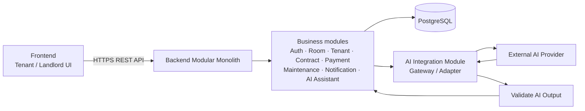
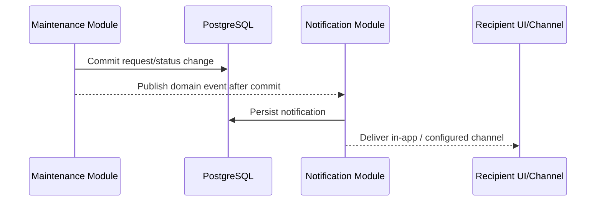
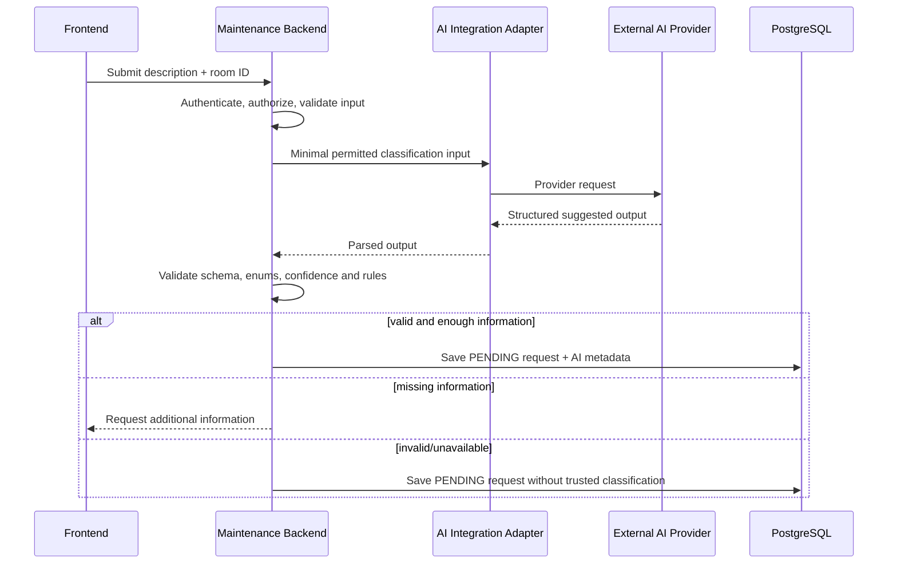

# 5.1 Thiết kế Kiến trúc Phần mềm – SmartRent

## 1. Architecture Overview

SmartRent sử dụng **Modular Monolith** với **Layered Architecture** và giao tiếp client–server qua **REST API**. Đây là một ứng dụng triển khai như một backend thống nhất, nhưng được chia thành các module nghiệp vụ có ranh giới rõ ràng. PostgreSQL là nguồn dữ liệu chính thức của hệ thống. AI được đặt sau AI Integration Module/Adapter Boundary; AI provider chỉ nhận dữ liệu tối thiểu mà backend cho phép và không được truy cập hệ thống nội bộ trực tiếp.



Sơ đồ chi tiết, các boundary và luồng chính được lưu tại [architecture artifact](../../design/architecture/smartrent-architecture.md).

## 2. Architectural Goals

- Đáp ứng MVP quản lý phòng, người thuê, hợp đồng, tiền thuê, yêu cầu bảo trì, thông báo và hai khả năng AI trong Chapter 3.
- Bảo vệ dữ liệu theo tenant/landlord và buộc authorization được kiểm tra ở backend.
- Cho phép người thuê vẫn tạo được Maintenance Request khi AI chậm, lỗi hoặc không khả dụng.
- Giữ business rules, trạng thái và dữ liệu giao dịch có tính nhất quán trong một nguồn sự thật PostgreSQL.
- Dễ hiểu, dễ kiểm thử và đủ đơn giản cho giai đoạn MVP; đồng thời cho phép tách module sau này khi có bằng chứng về nhu cầu scale.

## 3. Architectural Drivers

| Driver | Nguồn liên kết | Hệ quả kiến trúc |
|---|---|---|
| Quản lý rental data tập trung | PRD FR-02 đến FR-05 | Module nghiệp vụ dùng PostgreSQL chung, transaction do backend quản lý. |
| Role-based access | Requirement Analysis FR-01; User Flow business rules | AuthN/AuthZ boundary nằm trước business use case; mọi truy cập dữ liệu được scope theo chủ thể và tài sản. |
| Maintenance lifecycle | FR-06, FR-07; Chapter 4 user flow | Maintenance Module sở hữu workflow `PENDING → PROCESSING → COMPLETED` (và `CANCELLED` khi hợp lệ). |
| AI classification có cấu trúc | Feature F-01, US-08 | AI Adapter, schema validation, enum/threshold validation và fallback manual. |
| Thông báo theo sự kiện | FR-08, US-09 | Notification Module nhận domain event sau khi business state được commit. |
| AI an toàn, minh bạch | PRD AI requirements; Chapter 4 review | AI không có DB credential, không authorization, không transition trạng thái critical. |

## 4. Các thành phần chính của hệ thống

| Thành phần | Trách nhiệm | Không chịu trách nhiệm |
|---|---|---|
| Frontend | Hiển thị UI, giữ session token an toàn, gọi REST API, hiển thị AI result/fallback. | Tin cậy client-side authorization hay tự xác nhận business state. |
| REST API / Controller | Nhận request, xác thực input, chuyển user context sang use case, trả response chuẩn. | Chứa business rules phức tạp. |
| Auth & Authorization Module | Login, xác thực token/session, role và ownership/policy check. | Cấp quyền cho AI provider. |
| Domain modules | Use case và rules của Room, Tenant, Contract, Payment, Maintenance, Notification, AI Assistant. | Gọi provider AI trực tiếp từ controller. |
| Data access layer | Repository/unit-of-work, transaction, truy vấn PostgreSQL. | Expose database cho frontend hoặc AI. |
| AI Integration Module | Chuẩn hóa prompt/request, gọi provider, timeout/retry an toàn, parse/validate output. | Quyết định quyền, ghi DB trực tiếp, hoàn tất request. |
| Notification Module | Tạo in-app notification và adapter kênh gửi sau event. | Thay đổi Maintenance state. |

## 5. Frontend Architecture

Frontend tổ chức theo feature/screen tương ứng Dashboard, Rooms, Tenants, Contracts, Payments, Maintenance, Notifications và AI Assistant. Mỗi feature dùng API client dùng chung để gửi REST request qua HTTPS, xử lý loading/error state và render dữ liệu server trả về.

Frontend có thể hỗ trợ trải nghiệm bằng cách kiểm tra form bắt buộc, nhưng validation và authorization có hiệu lực luôn được thực thi lại tại backend. Với Maintenance Request, UI giữ nguyên mô tả gốc, trình bày category/priority/summary/confidence là gợi ý AI, hiển thị màn hình bổ sung thông tin khi cần, và hiển thị fallback `PENDING` khi AI unavailable theo wireframe/prototype Chapter 4.

## 6. Backend Architecture

Backend là một deployable Modular Monolith gồm các module: `Identity & Access`, `Room`, `Tenant`, `Contract`, `Payment`, `Maintenance`, `Notification`, `AI Assistant` và `AI Integration`. Mỗi module có các layer sau:

```text
REST Controller
  → Application Service / Use Case
    → Domain Rules / Policy
      → Repository (Data Access)
        → PostgreSQL
```

Controller không truy cập database trực tiếp. Application service điều phối transaction, policy authorization và domain event. Domain layer sở hữu validation nghiệp vụ, ví dụ quyền phòng đang thuê, ownership của landlord và các transition Maintenance hợp lệ. Module có thể gọi nhau qua interface/use case hoặc domain event trong cùng process, tránh phụ thuộc vào bảng dữ liệu nội bộ của nhau.

## 7. Database Layer

PostgreSQL lưu dữ liệu authoritative: user/role, property/room, tenant relationship, contract, payment, maintenance request, lịch sử trạng thái và notification. Maintenance Request lưu mô tả gốc, room reference, creator, status, category/priority/summary AI (nếu hợp lệ), confidence, missing-information state và audit timestamps. AI output chỉ là metadata hỗ trợ, không phải nguồn quyền hay lệnh thực thi.

Repository layer áp dụng transaction cho các thay đổi business state liên quan. Ràng buộc khóa ngoại, enum/check constraint phù hợp và index theo các truy vấn thường dùng (owner/room, tenant, status, created time) bảo vệ integrity và hiệu năng. Tài khoản ứng dụng database có quyền tối thiểu; không có credential database nào được cấp cho external AI provider.

## 8. AI Integration Layer

AI Integration Module là boundary duy nhất từ backend sang external AI provider. Nó nhận **input đã được authorize và tối thiểu hóa**, gồm mô tả request, room context cần thiết và ngữ cảnh câu hỏi đã được backend lọc. Module có provider adapter để có thể thay provider mà không làm rò rỉ SDK/prompt vào domain module.

Với classification, adapter yêu cầu output có schema: `category`, `priority`, `summary`, `missing_information`, `confidence`. Sau phản hồi, backend kiểm tra JSON/schema, enum category (`ELECTRICITY`, `PLUMBING`, `INTERNET`, `AIR_CONDITIONER`, `FURNITURE`, `CLEANING`, `OTHER`), enum priority, kiểu/độ dài summary, danh sách missing information và khoảng confidence. Output sai schema, thiếu trường, timeout hay lỗi provider được xem là failure; không được đi thẳng vào database hay business workflow.

AI Assistant chỉ nhận dữ liệu mà backend truy xuất và lọc theo quyền của user. Nó không được tự query PostgreSQL, không bịa dữ liệu thiếu, không xác nhận giao dịch tài chính, không gọi internal write operation.

## 9. Authentication & Authorization Boundary

Mọi REST request trước tiên đi qua authentication để tạo `authenticated user context`. Use case sau đó thực hiện authorization server-side dựa trên role và ownership/relationship:

- Tenant chỉ tạo request cho room có quan hệ thuê/hợp đồng còn hiệu lực và chỉ xem request của mình.
- Landlord/Manager chỉ xem hoặc quản lý room/request thuộc tài sản được gán quản lý.
- Chỉ actor được phép mới thực hiện transition trạng thái theo policy.

ID do frontend gửi là input không đáng tin cậy; backend luôn kiểm tra ownership bằng dữ liệu server-side. AI không nhận token nội bộ, không là principal và không được tham gia vào bất kỳ quyết định authorization nào.

## 10. Notification Flow



Notification chỉ được tạo sau khi transaction nghiệp vụ thành công: request mới thông báo landlord; thay đổi trạng thái thông báo tenant; sự kiện payment/contract quan trọng cũng đi qua cùng module. Lỗi gửi kênh ngoài không rollback Maintenance state; notification được lưu/pending để có thể retry theo chính sách vận hành.

## 11. Maintenance Request Flow

1. Tenant gửi mô tả và room qua Frontend → REST API.
2. Backend authentication, validation và authorization xác minh tenant có quyền với room và hợp đồng còn hiệu lực.
3. Maintenance Module tạo draft/use case; AI classification được gọi như bước hỗ trợ.
4. Nếu output AI hợp lệ và đủ thông tin, backend lưu request với metadata đã validate. Nếu thiếu thông tin, backend trả yêu cầu bổ sung; không suy đoán để tạo classification đáng tin cậy.
5. Khi request được tạo, backend gán trạng thái ban đầu `PENDING`, commit transaction và phát event notification cho landlord.
6. Landlord được authorize chuyển request sang `PROCESSING`; khi công việc thực tế hoàn tất, landlord/manager được authorize mới có thể chuyển `COMPLETED`. Transition `CANCELLED` tuân theo policy nghiệp vụ.

AI không thể tự tạo transition `PROCESSING`, `COMPLETED` hoặc tự hoàn tất Maintenance Request.

## 12. AI Classification Flow



Confidence là tín hiệu hiển thị/hỗ trợ review, không tự nó kích hoạt critical action. Category/priority AI cũng chỉ là giá trị được backend xác nhận theo schema và vẫn có thể được landlord xử lý thủ công theo policy.

## 13. AI Failure / Fallback Flow

Các lỗi gồm timeout, rate limit, network/provider error, response không parse được, output không đúng schema hoặc không đạt validation. Backend ghi audit/log an toàn (không ghi secret hoặc dữ liệu nhạy cảm không cần thiết), đánh dấu AI classification unavailable/invalid, sau đó:

```text
AI failure
  → do not trust or persist AI recommendation as classification
  → save Maintenance Request with status PENDING and original description
  → create notification for landlord/manual queue
  → frontend explains: request received; manual handling will continue
```

Không retry vô hạn trong user request. Retry có giới hạn/circuit breaker ở adapter và một tác vụ vận hành có thể phân loại lại request chưa phân loại sau này; việc đó vẫn chỉ cập nhật metadata qua backend validation, không đổi trạng thái critical. Fallback bảo toàn acceptance criteria Chapter 4: manual request creation luôn khả dụng khi AI fails.

## 14. Data Flow

```text
Frontend
  → authenticated HTTPS REST request
  → Controller validation
  → Application use case + authorization policy
  → Domain rule and transaction
  → Repository → PostgreSQL
  → domain event → Notification Module
  → sanitized REST response → Frontend

Optional AI branch:
Backend-authorized minimal input
  → AI Integration Adapter → External AI Provider
  → parse + validate output → Business Logic
  → PostgreSQL (metadata only if valid)
```

Raw user input and original description remain traceable in backend/database. Data returned to each frontend session is filtered by the same authorization boundary. External AI receives only necessary permitted input; provider response is untrusted until validated.

## 15. Security Boundary

- **Public boundary:** Frontend only reaches versioned REST API over HTTPS; input validation, rate limiting and consistent error responses are applied at API boundary.
- **Identity boundary:** token/session verification establishes caller identity; credentials and secrets are stored/configured outside source control.
- **Authorization boundary:** backend enforces RBAC plus resource ownership for every protected use case. Frontend navigation and AI output never grant permissions.
- **Data boundary:** only backend data-access layer connects to PostgreSQL; parameterized queries/ORM mappings, least-privilege roles, encryption in transit and backup/access controls protect data.
- **AI boundary:** AI Adapter has no direct DB access, no internal authorization privileges and only uses provider credentials. PII/context is minimized before egress; output is treated as untrusted data.
- **Audit boundary:** security-relevant operations and status changes retain actor/time/request context for traceability, while logs avoid passwords, tokens and unnecessary sensitive content.

## 16. Non-functional Requirements liên quan đến architecture

| NFR | Thiết kế đáp ứng |
|---|---|
| Security | HTTPS, server-side AuthN/AuthZ, ownership check, least privilege, AI boundary và audit trail. |
| Reliability | PostgreSQL transaction, after-commit notification event và AI fallback tạo request `PENDING`. |
| Performance | REST API stateless theo request; index truy vấn danh sách/status; AI call timeout và có thể xử lý bất đồng bộ khi cần. |
| Usability | Trạng thái rõ ràng, giữ original description, display confidence/fallback minh bạch theo Chapter 4. |
| Maintainability | Module + layer + provider adapter giảm coupling; domain rules tập trung và dễ test. |
| Scalability | Có thể scale ngang backend stateless, dùng connection pooling/caching phù hợp; tách workload sau khi đo đạc. |
| Observability | Correlation/request ID, metric latency/error cho API/AI, audit status transition; giám sát AI failure rate. |

## 17. Architecture Decision

**AD-01: Chọn Modular Monolith + Layered Architecture + REST API + PostgreSQL + AI Gateway/Adapter Boundary cho MVP.**

Lý do: domain hiện tại có các nghiệp vụ liên quan chặt chẽ (room, tenant, contract, payment, maintenance, notification); một deployable và transaction tập trung giảm độ phức tạp vận hành. Module boundary giữ code sẵn sàng tách khi thật sự cần. REST phù hợp cho Frontend và tài nguyên CRUD/workflow MVP. PostgreSQL phù hợp quan hệ và tính nhất quán. AI adapter cô lập nhà cung cấp, kiểm soát dữ liệu và kiểm tra output trước business logic.

Quyết định này **không** chuyển SmartRent thành microservices ở giai đoạn hiện tại.

## 18. Trade-offs

| Lựa chọn | Lợi ích | Đánh đổi và cách kiểm soát |
|---|---|---|
| Modular Monolith | Đơn giản triển khai, debugging, transaction xuyên module. | Một deployable có thể scale cùng nhau; giữ module interface và ownership rõ để tránh monolith lộn xộn. |
| PostgreSQL chung | Integrity và báo cáo/truy vấn liên domain dễ. | Cần kỷ luật schema/repository ownership để hạn chế coupling. |
| REST đồng bộ | Frontend tích hợp rõ ràng, dễ quan sát. | AI có độ trễ; áp timeout, fallback và có thể chuyển classification sang async khi cần. |
| AI provider ngoài | Nhanh có năng lực NLP. | Phụ thuộc availability/cost/privacy; adapter, minimal data, validation, retry bounded và fallback manual. |
| AI metadata | Hỗ trợ ưu tiên/tóm tắt cho landlord. | Có thể sai; không dùng làm authority hay tự động thực thi hành động critical. |

## 19. Future Scalability

Khi có số liệu tải và nhu cầu vận hành thực tế, SmartRent có thể phát triển mà không đổi nguyên tắc cốt lõi:

1. Đặt AI classification, notification delivery hoặc reporting vào job queue/worker để tách khỏi request latency; transaction tạo request và fallback vẫn giữ nguyên.
2. Scale ngang backend stateless sau load balancer; dùng PostgreSQL connection pooling, index và read replica khi phù hợp.
3. Thêm cache cho dữ liệu đọc nhiều với chính sách invalidation rõ ràng, không cache vượt qua authorization boundary.
4. Tách riêng một module thành service chỉ khi có ownership độc lập, tải/availability khác biệt và hợp đồng API/event ổn định—ví dụ Notification hoặc AI Integration—thay vì tách microservices sớm.
5. Bổ sung provider AI dự phòng qua adapter, monitoring chi phí/chất lượng và human review cho các quyết định vận hành nhạy cảm.

## Traceability

| Artefact trước đó | Nội dung được kiến trúc hóa |
|---|---|
| Chapter 3 PRD / Requirement Analysis | FR-01 đến FR-10: modules, REST/API boundary, PostgreSQL, notification và AI boundary. |
| Chapter 3 User Stories / Feature Specification | Quyền theo vai trò, output classification có cấu trúc, AI Assistant chỉ dùng data backend cho phép. |
| Chapter 4 User Flow | Backend authorization → AI → validate → save → notify; lifecycle `PENDING → PROCESSING → COMPLETED`. |
| Chapter 4 Wireframe / Prototype / AI Review | Original description, missing-information UX, AI-unavailable `PENDING` fallback, AI không có authority. |
