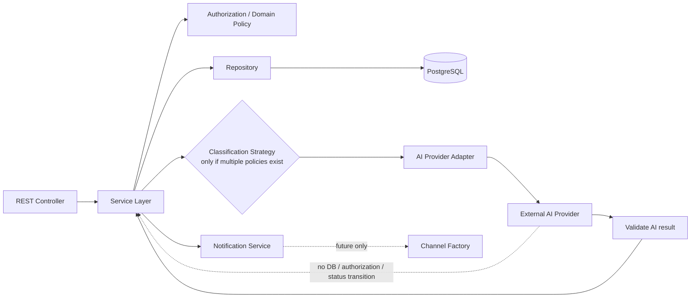

# 5.6 Design Patterns – SmartRent

> Sprint 0 revision: see the [decision baseline](../sprint-0-decisions.md). New ownership/lifecycle/billing/preview policies are working baseline until the named review gate passes; this document is a design artifact, not implemented behavior. Canonical FR IDs follow Requirement Analysis.

## 1. Principle and decision summary

> **Use a design pattern only when it solves a real design problem.**

Design patterns are local design choices inside the existing Modular Monolith; they do not introduce microservices or implementation code. The current decisions are: adopt Repository, Service Layer and Adapter; introduce Strategy only when multiple classification policies are active; introduce Factory only when Notification has more than one configured channel/constructor path.

| Pattern | Decision now | Real problem addressed |
|---|---|---|
| Repository | Adopt | Isolate PostgreSQL/data-access details from application use cases. |
| Service Layer | Adopt | Keep controllers thin and centralize authorization, transaction and business workflow. |
| Adapter | Adopt | Isolate external AI provider contract and protect AI boundary. |
| Strategy | Conditional | Select among genuinely different classification approaches without branching service logic. |
| Factory | Conditional | Create configured notification channel handlers only if multiple channels exist. |

## 2. Repository Pattern

### Problem and intent

Controllers/use cases need persistence for `users`, `properties`, `rooms`, `contracts`, `payments`, `maintenance_requests` and `notifications`, but must not depend on SQL/ORM/query details. Repository provides a domain-oriented data-access boundary so business logic can be tested and PostgreSQL implementation details remain localized.

### Structure

```text
REST Controller
  → Application Service
    → Repository interface / data-access implementation
      → PostgreSQL
```

### SmartRent use case and example component

`MaintenanceService` uses `MaintenanceRequestRepository` to persist a new `PENDING` request and retrieve requests scoped by tenant/room/status. `ContractRepository` supplies the active tenant–room relationship used by authorization. `NotificationRepository` persists notifications after commit. Repository does not decide whether the caller is permitted or whether status transition is valid; those are Service/Domain responsibilities.

### Benefits

- Preserves the Controller → Service → Repository → Database boundary required by 5.1.
- Keeps SQL/ORM, transaction queries, indexes and PostgreSQL type mapping out of REST controllers.
- Improves testability of use cases through repository contracts and supports focused query optimization.
- Supports schema ownership described in 5.4 without exposing database to AI or frontend.

### Trade-offs and need

Repository adds interfaces/mapping and can become a useless pass-through abstraction if it simply mirrors every table operation. It is **actually needed** for SmartRent because authorization-scoped queries, maintenance workflow persistence and PostgreSQL isolation are real concerns. Keep repositories module-owned and query-focused; do not create a generic repository that bypasses domain ownership.

## 3. Service Layer

### Problem and intent

HTTP controllers should not contain authorization, lifecycle transitions, AI orchestration, transaction boundaries or notification event publication. Service Layer coordinates a complete application use case while delegating persistence to repositories and external integration to adapters.

### Structure

```text
MaintenanceController
  → MaintenanceService
    → AuthorizationPolicy + Domain transition rules
    → MaintenanceRequestRepository / ContractRepository
    → AIIntegrationAdapter (when requested)
    → post-commit Notification event
```

### SmartRent use case and example component

`MaintenanceService.previewRequest` authorizes effective tenancy and calls the AI Adapter without business persistence. `MaintenanceService.createRequest` handles explicit confirmation/manual submission: reauthorize, verify optional bound preview, deduplicate submission key, persist PENDING and emit only after new successful commit. It does not call Gemini within the write transaction. `MaintenanceService.changeStatus` verifies property management and allowed transition before persistence. Equivalent services coordinate Property, Room, Contract, Payment and Notification use cases.

### Benefits

- Centralizes backend-only authorization and business rules required by Chapter 3/4.
- Makes transaction and after-commit behavior explicit and reusable across REST/API entry points.
- Ensures AI output is processed as untrusted data before repository write.
- Keeps controllers and AI adapters small, focused and testable.

### Trade-offs and need

Service Layer can grow into a “god service” or duplicate domain rules if modules are not bounded. It is **actually needed** because SmartRent has nontrivial cross-component flows (authorization → AI validation → persistence → notification) that cannot safely live in controllers or repositories. Split by module/use case rather than create one global service.

## 4. Adapter Pattern

### Problem and intent

External AI providers have provider-specific SDKs, request formats, errors and output behavior. Domain modules must not depend on them or let them access PostgreSQL/authorization. Adapter presents a stable SmartRent-side interface and translates provider-specific details at one boundary.

### Structure

```text
AIService / MaintenanceService
  → AIProvider interface
    → AI Provider Adapter
      → External AI Provider
  ← parsed result → AI Result Validator → Business Logic
```

### SmartRent use case and example component

`AIClassificationProvider` (the SmartRent-facing interface) returns a parsed classification suggestion. A provider adapter maps only minimal authorized input to the external AI provider and maps its response/error back to the internal contract. `AIResultValidator` checks category, priority, summary, missing information and confidence before `MaintenanceService` may save metadata. The same boundary can support the AI Assistant with backend-filtered context.

### Benefits

- Prevents provider SDK/prompt details from leaking into Controller, Service or Repository.
- Enables replacement/fallback provider and isolated integration testing.
- Enforces one outbound data-minimization, timeout/retry and observability boundary.
- Reinforces guardrails: no direct DB, no authorization, no critical state transition from AI.

### Trade-offs and need

Adapter requires maintaining an internal contract and mapping layer; a premature multi-provider abstraction can hide useful provider capabilities. It is **actually needed** now because SmartRent already uses an external AI dependency with security, structured-output and failure requirements. Start with one adapter and one internal contract; add providers only when warranted.

## 5. Strategy Pattern

### Problem and intent

If classification policy can vary—e.g., trusted AI classification versus a deterministic rule-based fallback—putting `if provider fails then ...` throughout `MaintenanceService` makes policy selection hard to test and extend. Strategy encapsulates interchangeable algorithms behind a classification contract.

### Structure

```text
ClassificationStrategy
  ├── AIClassificationStrategy → AI Integration Adapter → AI Provider
  └── RuleBasedClassificationStrategy → deterministic allowed rules

MaintenanceService → selects strategy by explicit policy → validates result → persists metadata/fallback
```

### SmartRent use case and example component

The present mandatory behavior is not “guess a classification”: when AI is unavailable, save `PENDING` for manual handling. Therefore `AIClassificationStrategy` is sufficient for the current live AI flow. `RuleBasedClassificationStrategy` becomes appropriate only if product owners approve a deterministic, explainable fallback for known keywords/categories and its output still passes the same validator. A manual/no-classification outcome remains valid and is not replaced by risky inference.

### Benefits

- Makes approved selection policy explicit and independently testable.
- Allows deterministic fallback or future provider selection without changing Maintenance workflow.
- Keeps each strategy constrained to return a suggestion, never an authorization/status decision.

### Trade-offs and need

More classes/configuration are unnecessary with only one real algorithm; divergent strategy output can create inconsistent behavior. Strategy is **conditional, not required for MVP**. Do not introduce a rule-based fallback merely because the pattern exists. Adopt it only after requirements define approved rules, ownership, quality criteria and when manual `PENDING` fallback is insufficient.

## 6. Factory Pattern

### Problem and intent

Factory centralizes creation of objects whose concrete type depends on configuration or a requested channel. It should not be used merely to construct ordinary services with one implementation.

### Structure

```text
NotificationService
  → NotificationChannelFactory (only when needed)
    → InAppNotificationChannel
    → EmailNotificationChannel (future, if configured)
```

### SmartRent use case and example component

Current requirements require notifications, and the existing architecture supports an in-app/configured delivery channel. If SmartRent later enables multiple configured channels such as in-app and email, `NotificationChannelFactory` can choose a registered channel based on allowed notification configuration. Channel handlers consume already-authorized, post-commit notification data; they cannot mutate Maintenance/Payment/Contract state.

### Benefits

- Centralizes channel construction/configuration and avoids service-wide conditional branching.
- Lets new delivery channels be added without changing event/business workflow.
- Keeps credential/configuration handling away from Notification domain logic.

### Trade-offs and need

Factory adds indirection, registration/configuration rules and tests. With a single in-app channel, direct dependency injection/construction is clearer. Factory is **not actually needed for the current MVP**; it is a future option only when at least two real notification channel implementations are configured.

## 7. Boundary and pattern interaction



The Service Layer remains the owner of orchestration. Repository is the only database-access pattern in this view. Adapter/Strategy only return untrusted suggestions to validation. Factory, if introduced, belongs to notification delivery construction, not business-state creation.

## 8. Pattern decision rules

- Prefer a direct dependency when there is one implementation and no varying construction/policy.
- Add an interface only at a real boundary: persistence, provider integration or policy with multiple implementations.
- Keep authorization, transaction and lifecycle control in Services/Domain Policies regardless of pattern.
- Review a conditional pattern when a concrete second implementation/configuration and its acceptance criteria exist.
- Remove/avoid abstractions that no longer hide meaningful volatility.

## 9. Traceability

| Existing design | Pattern consequence |
|---|---|
| 5.1 Layered Architecture | Repository and Service Layer realize controller-to-PostgreSQL dependency direction. |
| 5.1 AI Integration Boundary | Adapter is mandatory; provider output returns through validation. |
| 5.1 Notification after commit | Factory is only a future channel-construction option. |
| 5.2 Modular Monolith | Patterns stay module-local; they do not create services/deployables. |
| 5.3 UML / 5.4 Database | Repository respects entity/module ownership and FK/integrity constraints. |
| 5.5 API | Service Layer owns endpoint use cases; classification endpoint never exposes provider/database access. |

## Confirmation boundary

Read-only preview, missing-info and provider errors never create a business request by themselves. All references to saving a fallback mean explicit user-confirmed manual submission followed by reauthorization and commit. Follow the shared Maintenance API/sequence and D04 rather than treating an earlier orchestration example as automatic persistence.
