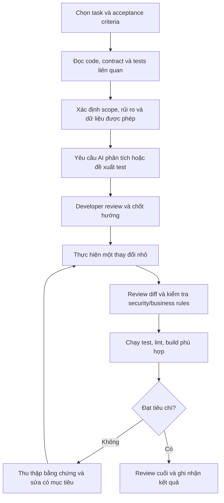

# 6.5 Quy trình Lập trình cùng AI

## Quy trình đề xuất

## Các bước

1. **Chọn task:** chọn một behavior có tiêu chí chấp nhận rõ, ưu tiên scope có thể review độc lập.
2. **Nạp context:** đọc implementation, call sites, test và tài liệu liên quan; phân biệt yêu cầu đã xác nhận với giả định.
3. **Đặt ranh giới:** chỉ rõ file/module được phép thay đổi, điều cấm, chuẩn bảo mật và công cụ kiểm chứng.
4. **Phân tích trước khi sửa:** yêu cầu AI tóm tắt luồng hiện tại, rủi ro và kế hoạch ngắn; con người xác nhận hướng.
5. **Triển khai theo lát nhỏ:** thường bắt đầu từ test hoặc thay đổi hẹp; không sinh lại module lớn nếu chưa cần.
6. **Review:** đọc toàn bộ diff, xem thay đổi ngoài ý muốn, API compatibility, authorization, error/fallback path và data handling.
7. **Xác minh:** chạy test liên quan trước; tiếp đến lint/typecheck/build theo yêu cầu dự án. Báo rõ lệnh nào không chạy được.
8. **Hoàn tất:** tóm tắt behavior, file thay đổi, kết quả kiểm tra, rủi ro còn lại và quyết định chấp nhận.

## Checklist trước khi gửi thay đổi

- Mọi thay đổi đều truy được về requirement hoặc bug đã nêu.
- Không có secret, dữ liệu nhạy cảm hoặc dependency không được phê duyệt.
- Authorization và business state vẫn do backend kiểm soát.
- Có test cho behavior mới và regression quan trọng.
- Test được chạy trên phiên bản code cuối cùng; kết quả được báo chính xác.
- Người gửi hiểu và có thể giải thích mọi dòng trong diff.

## Khi nào không dùng AI

Không đưa code/tài liệu bị hạn chế vào hệ thống AI chưa được phê duyệt; không dùng output chưa xác minh cho quyết định bảo mật, dữ liệu hoặc giao dịch quan trọng; không để AI tự thực hiện destructive operation; không tiếp tục dựa vào câu trả lời khi bằng chứng thực tế mâu thuẫn.